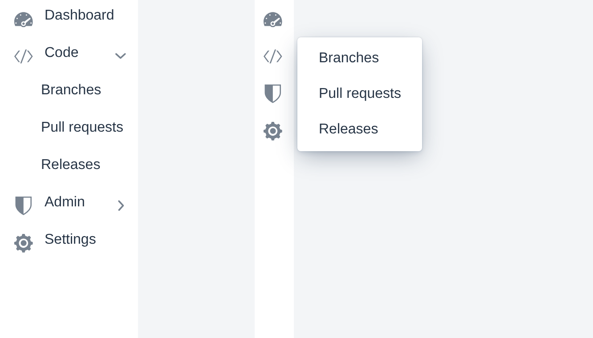

# SideNav Rail

A Vaadin Component Factory addon that adds a togglable rail mode to `<vaadin-side-nav>` — collapsed icon-only navigation with on-demand hover popovers, full keyboard support, and Lumo-styled tooltips.

[](https://vaadin.com/directory/component/vcf-side-nav-rail)



## Features

- **Rail mode toggle** — flip the nav between full-width and rail mode.
- **Hover popovers** for items with children, configurable in scope, with adjustable hover/hide delays, position, and arrow visibility.
- **Configurable rail-mode tooltips** on root items (all items / only items without children / off), with an optional browser-native `title` fallback.
- **Letter-avatar fallback** for root items without an icon (rail mode).
- **Subitem indicator** — visual cue on parent items, with full CSS-property control for glyph, color, and size.
- **Children-only-in-popover layout** — flat rail with descendants reachable only via the hover popover.
- **Auto `matchNested`** — opt in to highlight a root as `[current]` when any descendant route is active, scoped to rail mode or always-on.
- **Full keyboard navigation** — Arrow keys, Tab, Escape; ARIA roles and focus management handled for you.
- **Mode-change event** for downstream code that needs to react to the toggle.

## Compatibility

- **Vaadin Flow 24.9** or later — verified on 24.10 and 25.1.
- **Java 17** or later.
- Flow-only by design — Hilla / client-side views are not in scope.

## Installation

Add the dependency to your application's `pom.xml`:

```xml
<dependency>
    <groupId>org.vaadin.addons.componentfactory</groupId>
    <artifactId>vcf-side-nav-rail</artifactId>
    <version>1.0.0</version>
</dependency>
```

The artifact is published to the Vaadin Add-ons repository, so make sure that repository is on your project's resolution list:

```xml
<repositories>
    <repository>
        <id>vaadin-addons</id>
        <url>https://maven.vaadin.com/vaadin-addons</url>
    </repository>
</repositories>
```

## Quick start

You can use the `SideNavRail` like Vaadin's native `SideNav` component. All public types live in the `org.vaadin.addons.componentfactory.sidenavrail` package. Add `SideNavRailItem`s to populate the navigation; passing a plain `SideNavItem` to `addItem(...)` throws `IllegalArgumentException`.

```java
SideNavRail rail = new SideNavRail();

SideNavRailItem dashboard = new SideNavRailItem(
        "Dashboard", "/dashboard", VaadinIcon.DASHBOARD.create());

SideNavRailItem code = new SideNavRailItem(
        "Code", "/code", VaadinIcon.CODE.create());
code.addItem(new SideNavRailItem("Branches", "/code/branches"));
code.addItem(new SideNavRailItem("Pull requests", "/code/pulls"));

rail.addItem(dashboard, code);

Button toggle = new Button(VaadinIcon.CHEVRON_LEFT_SMALL.create(), e -> {
    rail.toggleRailMode();
    e.getSource().setIcon((rail.isRailMode()
            ? VaadinIcon.CHEVRON_RIGHT_SMALL
            : VaadinIcon.CHEVRON_LEFT_SMALL).create());
});

add(toggle, rail);
```

### No toggle button?

The addon intentionally ships without a built-in toggle button — applications differ too much in layout for a one-size-fits-all default. Wire your own button that calls `setRailMode(boolean)` or `toggleRailMode()`.

## Keyboard navigation and accessibility

The rail handles keyboard navigation and ARIA wiring out of the box; no extra setup is required. In rail mode only the root items are visible — nested items remain in the DOM but get `tabindex="-1"`, so the tab order matches what's on screen. The relevant ARIA attributes (`aria-haspopup`, `aria-expanded`, `aria-current`) are kept in sync as the rail mode toggles.

| Key | Behaviour |
| --- | --- |
| `Tab` / `Shift+Tab` | Move focus into and out of the rail. Items hidden in rail mode are skipped. |
| `↓` / `↑` | Move focus to the next / previous visible item, both inside the rail and inside an open popover. Stops at boundaries. |
| `→` | On a rail-root with children: open the hover popover and move focus into it. Elsewhere: expand a collapsed parent or descend into an expanded one. |
| `←` | Collapse an expanded item. Inside a popover: focus the popover-parent, or close the popover and return focus to the rail-root. Otherwise: focus the parent item. |
| `Esc` | Close the open popover and return focus to its owning rail-root. |

## Configuration

Most features can be configured to your needs. Please see the following sections for how to modify the `SideNavRail` settings:

### Popover behaviour

The rail shows sub-items as a hover popover when the rail is in rail mode. The same popover is also offered in normal mode by default, so users see the same nested children whether or not the rail is collapsed. `PopoverOn` controls when it appears:

- `ALL_COLLAPSED_ITEMS` (default) — popover for every collapsed parent, regardless of depth or rail mode.
- `ONLY_ROOT_COLLAPSED_ITEMS` — popover only for direct rail-children that are collapsed; nested levels behave like a stock `SideNav`.
- `ONLY_RAIL_MODE` — popovers only when rail mode is active; normal mode opens children inline on click.

```java
rail.setPopoverOn(PopoverOn.ONLY_ROOT_COLLAPSED_ITEMS);
```

### Popover header

`PopoverParentLabelMode` controls whether (and how) the parent's label appears as a header at the top of its popover:

- `NONE` (default) — no header.
- `LABEL_ONLY` — header shows the parent's text label only.
- `ICON_ONLY` — header shows a copy of the parent's prefix component (typically an icon) only.
- `FULL` — header shows both the prefix component and the label, icon first.

```java
rail.setPopoverParentLabelMode(PopoverParentLabelMode.FULL);
```

By default the header is rendered only while the rail is in rail mode — in normal mode the parent label is already visible inline, so the header would be redundant. When the rail uses `setChildrenOnlyInPopover(true)` (popover-only layout in normal mode too) you usually want the header in both modes; opt out via:

```java
rail.setPopoverParentLabelOnlyInRailMode(false);  // header in both modes
```

This flag has no effect while `PopoverParentLabelMode` is `NONE`.

### Popover delays

Popovers match Lumo's hover/hide-delay defaults (200 ms / 300 ms). Adjust them if your rail wants snappier or more forgiving timing:

```java
rail.setPopoverHoverDelay(150);  // ms before the popover opens
rail.setPopoverHideDelay(400);   // ms before it closes after the pointer leaves
```

### Popover position

Where the popover opens relative to its target item, expressed as Vaadin's `PopoverPosition`. Default: `END_TOP` — top-aligned, to the inline-end of the item (right in an LTR layout). Suitable for a rail pinned to the inline-start edge.

```java
rail.setPopoverPosition(PopoverPosition.START_TOP);  // for a right-edge rail in LTR
```

### Popover arrow

By default each popover renders the small Lumo arrow that points back at its target item. Toggle it off if you prefer a cleaner look — e.g. when popovers sit tightly against the rail and the arrow adds visual noise:

```java
rail.setPopoverArrowVisible(false);  // default: true
```

### Children only in popover

By default Vaadin's `<vaadin-side-nav-item>` auto-expands when a descendant route matches, so navigating to e.g. `/admin/users/active` shows the chain inline below the parent. If you want a flat, popover-driven look — children appear only in the hover popover, never inline — turn this on:

```java
rail.setChildrenOnlyInPopover(true);  // default: false
```

The native chevron toggle is hidden in this mode (it would have nothing to reveal in the rail itself). To preserve the visual hint that an item has more, the addon renders a small Lumo angle-right glyph next to parents — see the [Subitem indicator CSS custom properties](#subitem-indicator) below for how to restyle it.

Turning `setChildrenOnlyInPopover(false)` restores Vaadin's auto-expanded inline tree for the active route.

### Rail-mode tooltip

Because rail mode shows only icons, users may not be able to tell what each icon represents. The rail-mode tooltip surfaces each root item's label on hover or keyboard focus. Tooltips apply to the root items of the rail only.

`RailTooltipMode` controls which root items get one:

- `NONE` — no tooltips.
- `ONLY_WITHOUT_CHILDREN` — only root items that have no children (intended to be used with the **popover parent label mode**, where a tooltip would be redundant).
- `ALL` (default) — every root item, regardless of whether it has children.

```java
rail.setRailTooltipMode(RailTooltipMode.ONLY_WITHOUT_CHILDREN);
```

> The addon comes with its own tooltip implementation because Vaadin's native tooltip auto-dismisses itself whenever a popover opens — see [vaadin/web-components#9768](https://github.com/vaadin/web-components/issues/9768).
>
> A browser-native `title` fallback is available via `setRailTooltipNative(true)` for environments that need it. **Be aware that browser-native tooltips do not appear on keyboard focus** — sighted keyboard users will lose the label cue. The addon's default tooltip handles both hover and focus.

### Reacting to mode changes

You can react to rail mode toggles, using a dedicated event listener (`addRailModeChangedListener(...)`). Whenever the rail mode is toggled, this event listener will be informed.

```java
rail.addRailModeChangedListener(e ->
        log.info("rail mode now {}", e.isRailMode()));
```

### Active marker on rail icons

By default, Vaadin's `<vaadin-side-nav-item>` only flags an item as `current` when its own path matches the URL — so when a deeply nested route is active (e.g. `admin/users/active`), the rail-side root icon (Admin) does not pick up the active marker. Vaadin's own `setMatchNested(true)` flips this for an individual item, but you'd have to call it on every root manually and decide when to toggle it back.

`setRootMatchNested(RootMatchNested)` lets the addon manage that flag for you across all root items. This is especially useful when you display children only in the popover.

| Value | Behaviour |
| --- | --- |
| `NONE` (default) | The addon never touches `matchNested`. |
| `ONLY_RAIL` | Each root's `matchNested` is forced to `true` while the rail is in rail mode and restored on leaving rail mode. Recommended for the typical use case. |
| `ALL` | Each root's `matchNested` is always forced to `true`, regardless of rail mode. Useful in combination with [Children only in popover](#children-only-in-popover) or any other configuration where the visible inline tree doesn't expose deeper levels. |

```java
rail.setRootMatchNested(RootMatchNested.ONLY_RAIL);  // default: NONE
```

### Items without an icon

A root `SideNavRailItem` without an icon gets a letter-avatar built from the label automatically so that the rail still has an icon to show. This avatar is only shown in the rail mode.

```java
new SideNavRailItem("Profile", "/profile");                         // → "P" letter-avatar
new SideNavRailItem("Profile", "/profile", new Avatar("Profile"));  // → "P" letter-avatar that is also shown in normal mode (since set explicitly)
```

## Styling

The addon styles the underlying `<vaadin-side-nav>` so all of the [stock SideNav styling hooks](https://vaadin.com/docs/latest/components/side-nav/styling) — parts, slots, `[current]`, `[expanded]`, etc. — keep working. On top of that, rail mode and the addon's own affordances (popover header, rail tooltip, letter avatar, subitem indicator) introduce a few additional hooks.

Styling is split into three layers: **CSS custom properties** for tokens (colors, sizes, durations), **CSS selectors** for structural overrides, and **recipes** for common visual patterns. All custom properties default to Lumo tokens, so a stock app needs no CSS. Set them on `vaadin-side-nav` (or globally on `html`) to override.

### Style properties

#### Rail

| Property | Description | Default |
| --- | --- | --- |
| `--side-nav-rail-width` | Width of the rail in rail mode. | `var(--lumo-size-l)` |
| `--side-nav-rail-transition-duration` | Duration of the rail-mode collapse/expand animation. Set to `0s` to disable. | `200ms` |
| `--side-nav-rail-transition-easing` | Easing function for the same animation. | `ease-out` |

#### Subitem indicator

The visual cue that signals an item has children. Rendered as a `::before` pseudo-element on parent items. Shown in rail mode (always, for parents) and in normal mode when `setChildrenOnlyInPopover(true)` is on.

| Property | Description | Default                                                                              |
| --- | --- |--------------------------------------------------------------------------------------|
| `--side-nav-rail-subitem-indicator-content` | Glyph; any value valid for CSS `content` (e.g. another Lumo icon, an emoji, a string). | `var(--lumo-icons-angle-right)`                                                      |
| `--side-nav-rail-subitem-indicator-color` | Color of the indicator. | `var(--lumo-tertiary-text-color)`                                                    |
| `--side-nav-rail-subitem-indicator-size` | Indicator size in normal mode (rendered next to the label). | `var(--lumo-font-size-m)`                                                            |
| `--side-nav-rail-subitem-indicator-rail-size` | Indicator size in rail mode (rendered as a corner badge). | `0.625rem`                                                                           |

#### Rail-mode tooltip

| Property | Description | Default |
| --- | --- | --- |
| `--side-nav-rail-tooltip-hover-delay` | Delay before the tooltip appears on hover/focus. | `500ms` |
| `--side-nav-rail-tooltip-fade-duration` | Fade-in duration. | `120ms` |
| `--side-nav-rail-tooltip-background` | Background color. | `var(--lumo-contrast-90pct)` |
| `--side-nav-rail-tooltip-color` | Text color. | `var(--lumo-base-color)` |
| `--side-nav-rail-tooltip-padding` | Padding shorthand. | `0.1875em var(--lumo-space-xs)` |
| `--side-nav-rail-tooltip-border-radius` | Border radius. | `var(--lumo-border-radius-s)` |
| `--side-nav-rail-tooltip-font-size` | Font size. | `var(--lumo-font-size-s)` |

### CSS selectors

Use these in a global stylesheet (e.g. `frontend/themes/<my-theme>/styles.css`). They do not work in shadow-DOM-scoped sheets.

#### Rail states

| Selector | Description |
| --- | --- |
| `vaadin-side-nav[theme~="rail"]` | The rail itself, in rail mode. Set by `setRailMode(true)`. |
| `vaadin-side-nav[theme~="inline-children-hidden"]` | The rail with children-only-in-popover on. Set by `setChildrenOnlyInPopover(true)`. |

#### Items

| Selector | Description |
| --- | --- |
| `vaadin-side-nav-item[root-item]` | A direct child of the rail (top-level icon row in rail mode). Set by the addon. Useful for adding extra padding or a separator around top-level items. |
| `vaadin-side-nav-item[has-children]` | Any item that has nested items (Vaadin native, used by the addon's subitem indicator). |
| `vaadin-side-nav-item[data-rail-tooltip]` | Items that get a rail-mode tooltip (set when `RailTooltipMode != NONE`). The attribute value is the tooltip text and is fed straight into the `::after` pseudo-element via CSS `attr()`. |

#### Popover header (opt-in via `setPopoverParentLabelMode`)

The popover renders as a `<vaadin-popover>` overlay attached to `<body>`, so it lives outside the `<vaadin-side-nav>` subtree — a descendant selector like `vaadin-side-nav .side-nav-rail-popover-header` does not match. Target the class globally instead.

| Selector | Description |
| --- | --- |
| `.side-nav-rail-popover-header` | The header container (icon + label, depending on the mode). |
| `.side-nav-rail-popover-header-label` | The text label inside the header. |
| `.side-nav-rail-popover-header vaadin-icon` | The icon inside the header (when shown). |

#### Letter avatar (auto-generated for items without an icon)

| Selector | Description |
| --- | --- |
| `vaadin-avatar.side-nav-rail-letter-avatar` | The auto-generated avatar (only visible in rail mode by default). |
| `vaadin-avatar.side-nav-rail-letter-avatar::part(abbr)` | The letter glyph inside the avatar. |

#### Subitem indicator pseudo-element

| Selector | Description |
| --- | --- |
| `vaadin-side-nav-item[has-children]::before` | The subitem indicator itself. Non-interactive. |

### Recipes

#### Styling root items differently when only a child is active

When you enable [`matchNested`](#active-marker-on-rail-icons) (typically via `setRootMatchNested(...)`), a root item is marked `[current]` whenever any of its descendants matches the route — even if the root itself isn't the active page. By default Vaadin gives that root the same active highlight as the leaf, so both the root and the actually-active child end up looking equally "selected".

If you'd rather keep the active highlight on the leaf alone and tone the root down (or style it in a third, distinct way), the two cases can be told apart in pure CSS via `:has()`:

| Selector | Matches |
| --- | --- |
| `vaadin-side-nav-item[root-item][current]:not(:has(vaadin-side-nav-item[current]))` | The root itself is the active route. |
| `vaadin-side-nav-item[root-item][current]:has(vaadin-side-nav-item[current])` | The root is `[current]` only because a descendant is the active route. |

`[root-item]` is the addon's hook on direct children of `SideNavRail` (see [Items](#items)). The qualifier matters because `setRootMatchNested(...)` only forces `matchNested = true` on root items — nested parents in between keep their default behaviour and are never `[current]` purely because of a descendant route.

For example, to drop the active background and keep the default text color on roots that aren't themselves the active route:

```css
vaadin-side-nav-item[root-item][current]:has(vaadin-side-nav-item[current])::part(content) {
    background-color: transparent;
    color: var(--lumo-body-text-color);
}
```

`:has()` is supported in all browsers Vaadin 24 targets (Chrome 105+, Safari 15.4+, Firefox 121+).

### Further reading

- [Vaadin SideNav — styling reference](https://vaadin.com/docs/latest/components/side-nav/styling) — the parts, slots and properties of the underlying component, all of which apply here too.
- [Vaadin Popover — styling reference](https://vaadin.com/docs/latest/components/popover/styling) — for styling the overlay that hosts subitems.
- [Vaadin Avatar — styling reference](https://vaadin.com/docs/latest/components/avatar/styling) — for styling the letter-avatar fallback.

## Scope and known gaps

- **Dark mode**: supported automatically through Lumo — no extra wiring needed.
- **RTL layouts**: not currently validated. The rail uses logical CSS properties where possible, but RTL has not been exercised end-to-end.
- **Touch / mobile**: out of scope. The rail keeps its desktop hover-popover behaviour on touch devices.

## Building from source

```bash
./mvnw clean verify
```

Runs the addon's unit tests (Karibu-Testing in `addon/`) and the production-mode Playwright E2E suite (in `e2e/`).

## Running the demo

```bash
./mvnw -pl demo spring-boot:run
```

The demo runs on [http://localhost:8080](http://localhost:8080) and walks through the configuration options (popover modes, tooltip modes, `matchNested` variants, styling overrides) on a single live nav.

## License

Copyright © Vaadin Ltd. Licensed under Apache 2.0 — see [`LICENSE`](LICENSE).

## Contributing

Bug reports and feature requests are welcome at [github.com/vaadin-component-factory/vcf-side-nav-rail/issues](https://github.com/vaadin-component-factory/vcf-side-nav-rail/issues). For larger changes, please open an issue first to discuss the approach.
