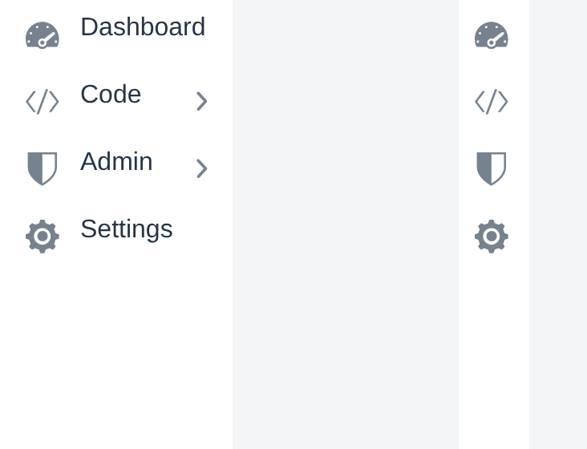
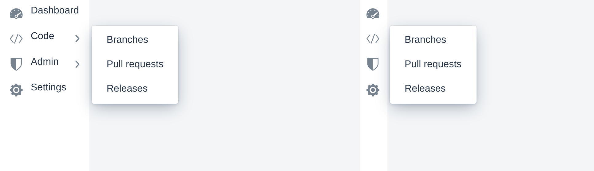
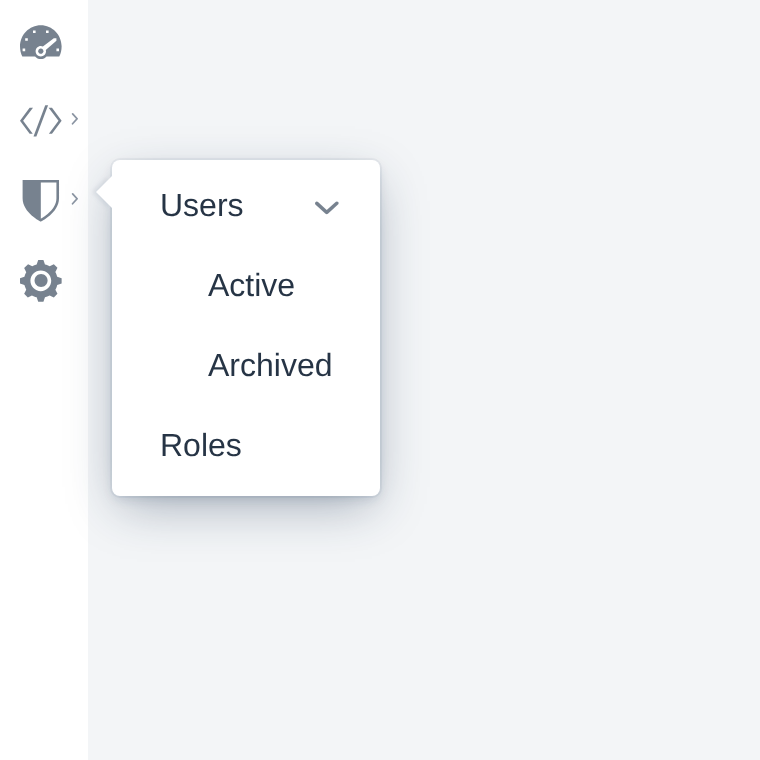
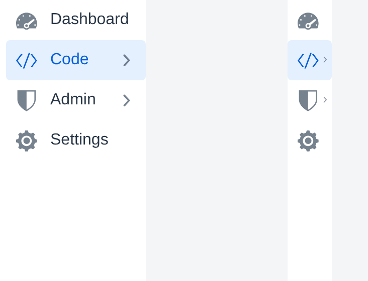
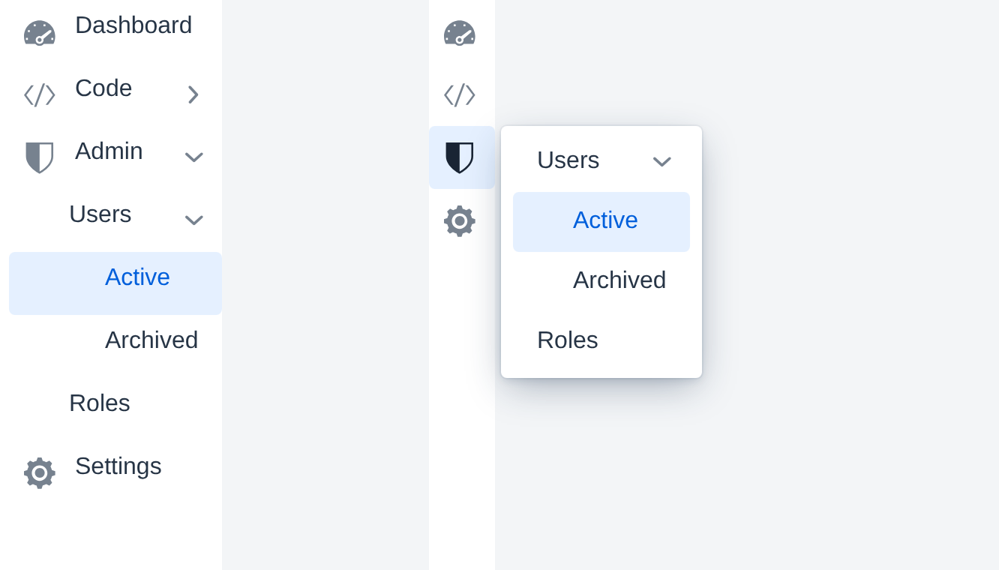

# SideNav Rail

A Vaadin Component Factory addon that adds a togglable rail mode to `<vaadin-side-nav>` — collapsed icon-only navigation with on-demand hover popovers, full keyboard support, and Lumo-styled tooltips.

[](https://vaadin.com/directory/component/vcf-side-nav-rail)

## Modes

The rail can be toggled between full-width labels and a compact icon-only column.



## Hover popovers

Items with children expose their submenu through a hover popover. Available in **both** modes — in normal mode, alongside inline expansion; in rail mode it's the only way the labels surface.



In normal mode you can still expand a parent inline with a click; the popover and inline expansion don't fight each other.


Sub-trees inside the popover behave like a regular `SideNav` — there's no second-level popover. Nested parents expand inline within the popover.



## Current-page highlighting

The active route is highlighted with the Lumo primary color. In rail mode, the matching root icon picks up the same accent.



When the current page is several levels deep, the highlight propagates: in normal mode the chain is auto-expanded down to the leaf; in rail mode the rail-side root carries the indicator and the popover (when open) shows the highlighted leaf.



## Features

- **Rail mode toggle** — flip between full-width and icon-only at runtime via `setRailMode(boolean)`.
- **Hover popovers** for items with children, configurable per-component (`PopoverMode.ALL_COLLAPSED_ITEMS`, `ONLY_ROOT_COLLAPSED_ITEMS`, `ONLY_RAIL_MODE`).
- **Full keyboard navigation** in both modes — arrow keys to walk the tree, `Enter` to navigate, `Esc` to close popovers, `Tab` for sequential traversal.
- **ARIA contracts** maintained automatically: `aria-haspopup="menu"`, `aria-expanded`, `role="menuitem"` on popover items.
- **CSS pseudo-element tooltips** that coexist with popovers (Vaadin's native tooltip flickers when peer overlays open; ours doesn't). Surfaces on hover *and* keyboard focus.
- **Letter-avatar fallback** for items without an icon — first letter of the label, Lumo-styled.
- **Lifecycle event** (`RailModeChangedEvent`) for downstream code that needs to react to the toggle.

## Compatibility

- Vaadin **24.9** or later
- Java **17** or later

## Installation

Add the dependency to your application's `pom.xml`:

```xml
<dependency>
    <groupId>org.vaadin.addons.componentfactory</groupId>
    <artifactId>vcf-side-nav-rail</artifactId>
    <version>1.0.0</version>
</dependency>
```

## Quick start

```java
SideNavRail rail = new SideNavRail();

SideNavRailItem dashboard = new SideNavRailItem(
        "Dashboard", "/dashboard", VaadinIcon.DASHBOARD.create());

SideNavRailItem code = new SideNavRailItem(
        "Code", "/code", VaadinIcon.CODE.create());
code.addItem(new SideNavRailItem("Branches", "/code/branches"));
code.addItem(new SideNavRailItem("Pull requests", "/code/pulls"));

rail.addItem(dashboard, code);

Button toggle = new Button(VaadinIcon.CHEVRON_LEFT_SMALL.create(),
        e -> rail.setRailMode(!rail.isRailMode()));

add(toggle, rail);
```

## API overview

- **`SideNavRail`** — the navigation container, an extension of `<vaadin-side-nav>` with rail-mode behaviour layered on top. Configures popover behaviour (`PopoverMode`), tooltip strategy (`RailTooltipMode`), and popover header text (`PopoverParentLabelMode`). Fires `RailModeChangedEvent` on every rail-mode toggle.
- **`SideNavRailItem`** — type-safe `<vaadin-side-nav-item>` subclass. Constructors accept `(label)`, `(label, path)`, or `(label, path, icon)`. Items can carry an optional `Avatar` instead of an icon.
- **`PopoverMode`** — controls when popovers render. `ALL_COLLAPSED_ITEMS` (default), `ONLY_ROOT_COLLAPSED_ITEMS`, or `ONLY_RAIL_MODE`.
- **`PopoverParentLabelMode`** — controls whether the parent's label appears as a header inside the popover (`NONE`, `INLINE`, `BOLD`). Default `NONE`.
- **`RailTooltipMode`** — controls which root items get a tooltip in rail mode. `NONE`, `ONLY_WITHOUT_CHILDREN`, or `ALL` (default). Use `setRailTooltipNative(true)` to swap the CSS pseudo-element for the browser-native `title` tooltip.
- **`RailModeChangedEvent`** — `ComponentEvent<SideNavRail>` carrying the new rail-mode boolean.

Full Javadoc is published with each release alongside the addon JAR.

## Building from source

```bash
./mvnw clean verify
```

Runs the addon's unit tests, the Karibu UI tests in `e2e/`, and the production-mode Playwright suite.

## Running the demo

```bash
./mvnw -pl demo spring-boot:run
```

The demo runs on [http://localhost:8080](http://localhost:8080) with hot reload enabled.

## License

Apache 2.0 — see [`LICENSE`](LICENSE).

## Contributing

Bug reports and feature requests are welcome at [github.com/vaadin-component-factory/side-nav-rail/issues](https://github.com/vaadin-component-factory/side-nav-rail/issues). For larger changes, please open an issue first to discuss the approach.
